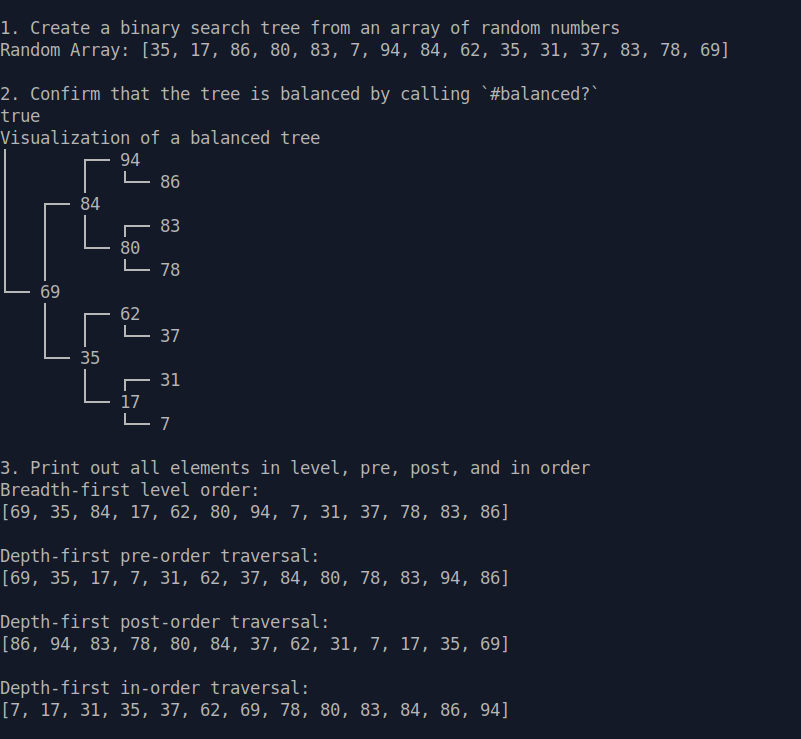
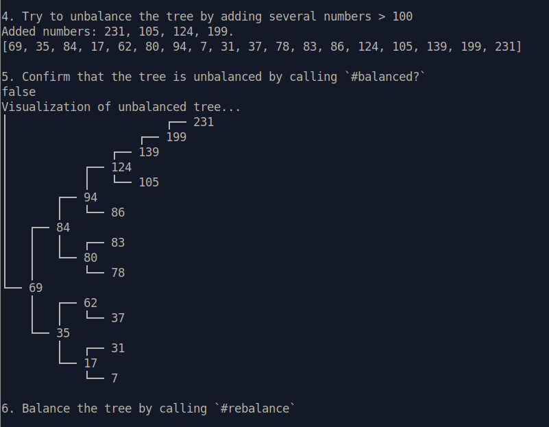
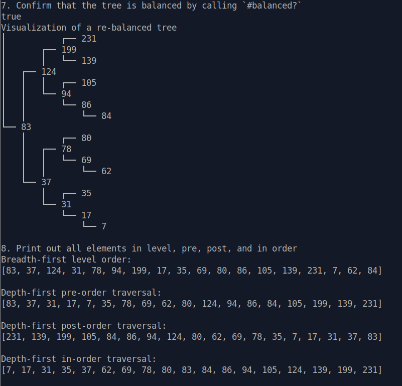
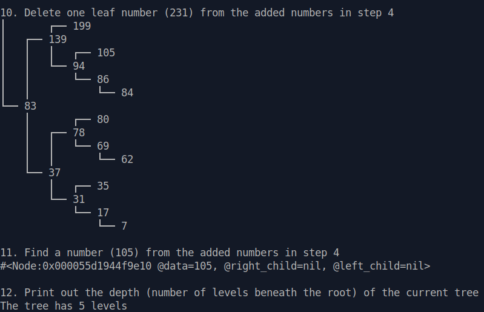

# Project: Data Structures and Algorithms
## Assignment 1: Binary Search Trees

Data structures and algorithms are the heart and soul of computer science and software, so I took some time to go deeper and I've finished additionally a Khan Academy [Algorithms](https://www.khanacademy.org/computing/computer-science/algorithms) and [Logarithms](https://www.khanacademy.org/math/algebra2/x2ec2f6f830c9fb89:logs) Courses. In order to have a different teaching approach and to continue my learning journey in algorithms it'd great to complete the [Stanford’s Coursera 4-Part Algorithm Course](https://www.coursera.org/specializations/algorithms) as well (#future_plans).

It was not really clear for me what are the real-life applications of binary trees apart the directories or file structure in your computer, so I found these answers on [Stack Overflow](https://stackoverflow.com/questions/2130416/what-are-the-applications-of-binary-trees) and [Quora](https://www.quora.com/What-are-some-practical-applications-of-binary-search-trees). Morse code is a nothing else than a binary tree!

Now to the assignment itself. 
Builds a balanced binary search tree from an ordered array of integers. Has basic operations such as `insert`, `delete`, `find`, breadth-first and depth-first different traversal orders (`level_order`, `preorder`, `inorder`, `postorder`) and a variety of additional features, like `balanced?`, `rebalance`, `depth`. As always a picture is worth a thousand words (kudos to @Fensus for `pretty_print`).

<p float = 'left'>
    
    
</p>

<p float = 'left'>
    
    
</p>

This assignment was slightly more challenging than the [linked list](https://github.com/Pandenok/linked_lists) assignment. And there were a couple of difficulties on my way to success, the biggest part due to the lack of attention, not understanding.

For example, when already writing a simple driver script to demo the functionality, out of the blue I'm getting an error `Undefined method '<' for nil` in `insert` method. It turns out there are some nodes with `nil` value in them in my array.
Here is a print out in breadth-first level order:
```ruby
[4, 15, 16, 33, 45, 51, nil, 53, 57, 67, 71, 83, 91, 95, nil]
```
So, it's normal than when I'm calling `insert` method to understand where to place a new node by comparing its value to the root (`node.data < value`) it can't compare `nil` to value. Good. Why the heck is going to compare it if there should be no child at all? The only other place where the nodes are instantiated is `build_tree` method and it returnes a Node with `nil` value when the array length is less than 2 elements. And this is my base case. Houston, we have a problem!
```ruby
return Node.new(sorted_array.first) if sorted_array.size <= 1
```
@rlmoser suggested to change it with `return if sorted_array.empty?`, because the way the recursive call is made, it can leave an array empty when it divides the array up (i.e when you have an array with 1 element like [5], it is going to divide it into two arrays = [5] and []).
Instead of the additional return statement it's possible to refactor the code as shown below and it will work too:
```ruby
return Node.new(sorted_array.first) if sorted_array.size <= 1
mid = sorted_array.size / 2

root = Node.new(sorted_array[mid])
if sorted_array[0...mid].size >= 1
  root.left_child = build_tree(sorted_array[0...mid])
end
if sorted_array[mid + 1..-1].size >= 1
  root.right_child = build_tree(sorted_array[mid + 1..-1])
end
```

### Refactor

After finishing the initial functionality, it's time to refactor the code. The first thing to do is to reduce the abundance of nested conditionals which makes it hard to determine the normal flow of code execution. It's better to isolate all special checks and edge cases into separate helper methods or place them before the main checks as guard clauses. It's a good practice to avoid unnecessary branching, and thus make your code more lean and readable. BTW, there is a convention to add a newline after the guard clause (nitpick) (thanks @Fensus). 

I got the confirmation from the community that ternary statements can be hard to 'read' and a lot of peers tend to use if statements. 

ABC size and Cyclomatic complexity for delete are still too high. Need to refactor further (#future_plans).